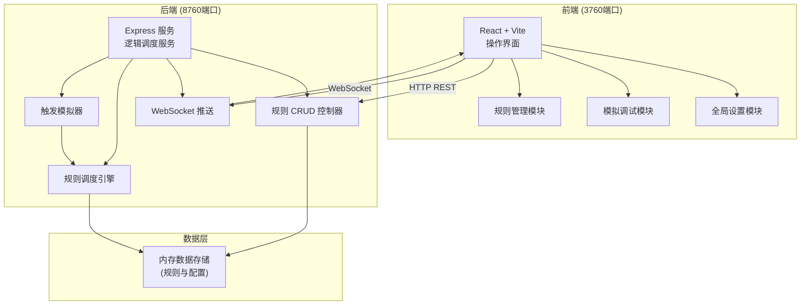
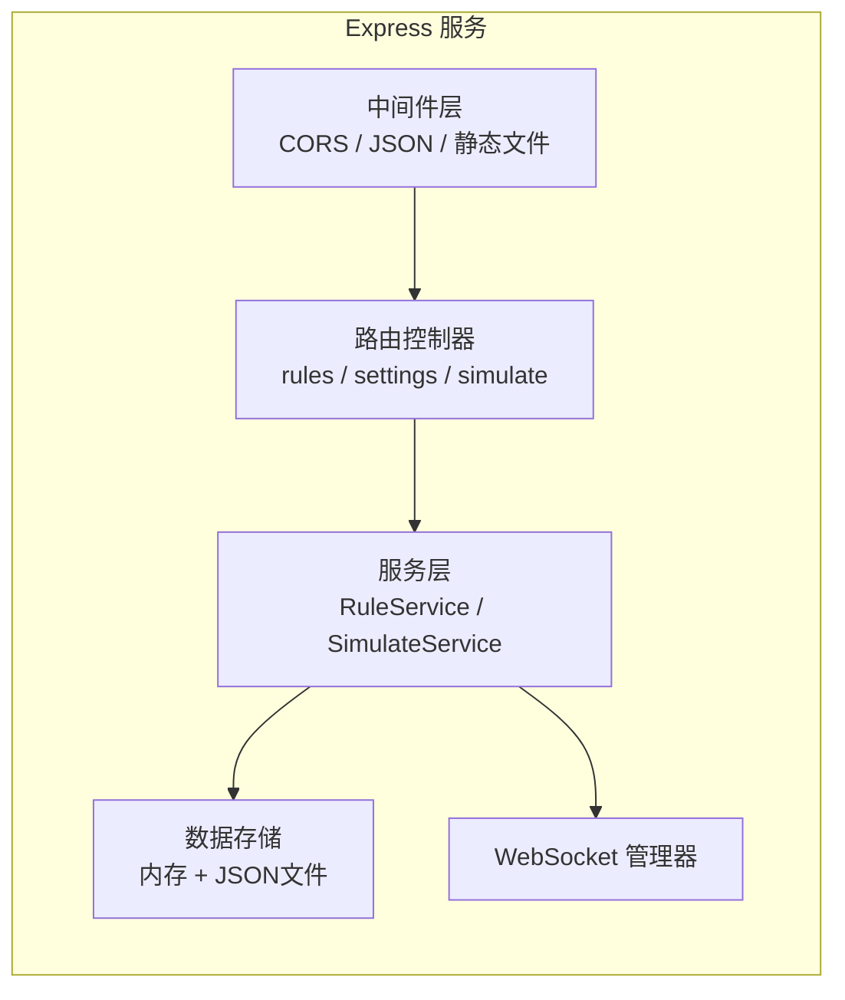
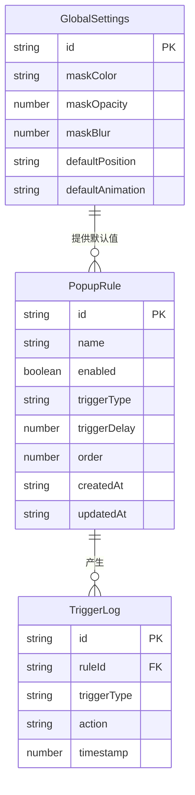

## 1. 架构设计



## 2. 技术说明

- **前端**：React@18 + TailwindCSS@3 + Vite，运行在 3760 端口
- **初始化工具**：Vite (create-vite)
- **后端**：Express@4 + ws (WebSocket)，运行在 8760 端口
- **数据库**：内存数据存储（Map/数组），规则数据以 JSON 持久化到本地文件
- **通信**：REST API 用于 CRUD，WebSocket 用于实时推送弹窗触发事件

## 3. 路由定义

| 路由 | 用途 |
|------|------|
| `/` | 规则管理页，展示规则列表 |
| `/debug` | 模拟调试页，实时弹窗展示与触发模拟 |
| `/settings` | 全局设置页，遮罩/弹窗默认值/主题配置 |

## 4. API 定义

### 4.1 规则管理 API

```typescript
interface PopupRule {
  id: string
  name: string
  enabled: boolean
  trigger: TriggerConfig
  position: PositionConfig
  close: CloseConfig
  style: PopupStyle
  content: PopupContent
  order: number
  createdAt: string
  updatedAt: string
}

interface TriggerConfig {
  type: 'page_load' | 'click' | 'dwell' | 'timer'
  delay: number           // 延迟毫秒数
  dwellTime?: number      // 停留时间（秒），dwell类型用
  timerInterval?: number  // 定时间隔（秒），timer类型用
  clickSelector?: string  // 点击目标选择器，click类型用
}

interface PositionConfig {
  vertical: 'top' | 'center' | 'bottom'
  horizontal: 'left' | 'center' | 'right'
  offsetX: number
  offsetY: number
}

interface CloseConfig {
  button: boolean         // 显示关闭按钮
  mask: boolean           // 点击遮罩关闭
  timeout: number         // 自动关闭毫秒数，0为不自动关闭
  escape: boolean         // ESC键关闭
}

interface PopupStyle {
  width: number
  height: number | 'auto'
  borderRadius: number
  animation: 'fade' | 'slide' | 'scale' | 'spring'
  maskColor: string
  maskOpacity: number
  maskBlur: number
}

interface PopupContent {
  title: string
  body: string
  imageUrl?: string
  confirmText?: string
  cancelText?: string
}
```

### 4.2 REST 接口

| 方法 | 路径 | 说明 |
|------|------|------|
| GET | `/api/rules` | 获取所有规则列表 |
| GET | `/api/rules/:id` | 获取单条规则详情 |
| POST | `/api/rules` | 创建新规则 |
| PUT | `/api/rules/:id` | 更新规则 |
| DELETE | `/api/rules/:id` | 删除规则 |
| PATCH | `/api/rules/:id/toggle` | 切换规则启用/禁用 |
| PUT | `/api/rules/reorder` | 规则排序 |
| GET | `/api/settings` | 获取全局设置 |
| PUT | `/api/settings` | 更新全局设置 |
| POST | `/api/simulate/trigger` | 模拟触发弹窗 |
| POST | `/api/simulate/cycle` | 启动循环测试 |

### 4.3 WebSocket 消息

```typescript
// 服务端推送
interface WsMessage {
  type: 'popup_show' | 'popup_close' | 'cycle_start' | 'cycle_step' | 'cycle_end' | 'log'
  data: {
    ruleId?: string
    ruleName?: string
    timestamp: number
    details?: string
  }
}
```

## 5. 服务架构图



## 6. 数据模型

### 6.1 数据模型定义



### 6.2 数据存储

- 规则数据存储在内存中，启动时从 `data/rules.json` 加载，变更时自动持久化
- 全局设置存储在 `data/settings.json`
- 触发日志仅在内存中保留最近 100 条
