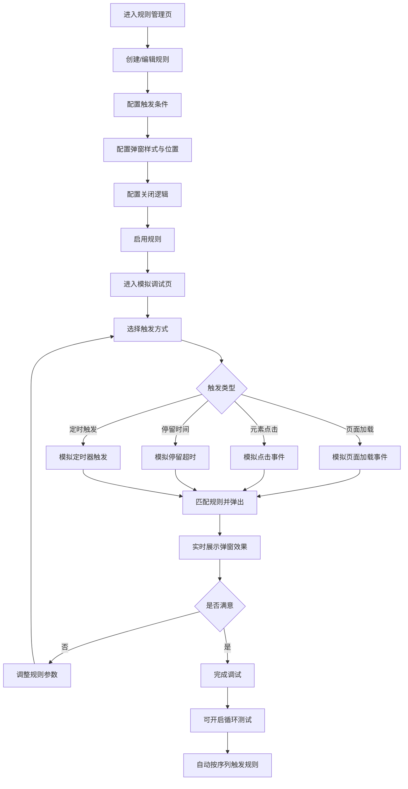

## 1. 产品概述

弹窗规则调度与调试平台，用于可视化配置、模拟测试和实时调试网页弹窗触发逻辑。面向开发者和产品运营人员，解决弹窗规则配置繁琐、调试困难、无法实时预览的痛点，提供从规则创建到效果验证的一站式体验。

- 目标用户：前端开发者、产品运营、UI设计师
- 核心价值：零代码配置弹窗触发规则，实时可视化调试，循环测试快速迭代

## 2. 核心功能

### 2.1 功能模块

1. **规则管理页**：规则列表、创建/编辑/删除规则、启用/禁用开关
2. **模拟调试页**：实时弹窗效果展示、触发条件模拟、循环测试
3. **全局设置页**：遮罩全局样式、弹窗默认位置、主题配置

### 2.2 页面详情

| 页面名称 | 模块名称 | 功能描述 |
|----------|----------|----------|
| 规则管理页 | 规则列表 | 展示所有弹窗规则卡片，每张卡片显示规则名称、触发条件摘要、启用状态开关，支持拖拽排序 |
| 规则管理页 | 规则编辑器 | 弹出侧面板，配置触发时机（页面加载/点击/停留/定时）、弹窗位置（九宫格选择）、关闭逻辑（按钮/遮罩/超时）、弹窗内容与样式 |
| 规则管理页 | 快速操作 | 每条规则右侧启用/禁用开关，一键切换；批量启用/禁用；复制规则；删除确认 |
| 模拟调试页 | 触发模拟器 | 提供四种触发按钮：页面加载模拟、元素点击模拟、停留时间滑块、定时器输入，点击后实时触发对应规则弹窗 |
| 模拟调试页 | 弹窗展示区 | 中央模拟屏幕区域，弹窗按配置的位置、样式、动画实时弹出，支持多个弹窗叠加展示 |
| 模拟调试页 | 循环测试 | 配置测试序列，自动按顺序触发多条规则，设定间隔时间，观察弹窗交互效果 |
| 模拟调试页 | 事件日志 | 右侧面板实时记录每次触发事件、弹窗弹出/关闭时间、匹配规则详情 |
| 全局设置页 | 遮罩样式 | 配置全局遮罩颜色、透明度、模糊效果、点击遮罩是否关闭 |
| 全局设置页 | 弹窗默认值 | 默认弹出位置、默认动画类型、默认关闭方式、默认尺寸 |
| 全局设置页 | 主题配置 | 亮色/暗色主题切换，主色调选择 |

## 3. 核心流程

用户创建弹窗规则 → 配置触发条件与弹窗样式 → 启用规则 → 进入模拟调试页 → 选择触发方式模拟 → 观察弹窗效果 → 调整规则参数 → 循环测试验证 → 确认规则配置

## 4. 用户界面设计

### 4.1 设计风格

- **风格定位**：工业风工具面板，精密仪表感，暗色主题为主
- **主色调**：深灰底色 (#0D1117) + 青绿强调色 (#00D4AA) + 琥珀警示色 (#FFAB00)
- **次色调**：卡片深灰 (#161B22)、边框灰 (#30363D)、文字灰 (#8B949E)
- **按钮风格**：圆角6px，微阴影，hover时边框发光
- **字体**：JetBrains Mono（代码/数据）+ Noto Sans SC（中文正文）
- **布局风格**：左侧导航栏 + 主内容区，卡片式规则展示
- **图标风格**：线性图标，2px描边，与文字等高对齐
- **动画**：弹窗弹出使用 spring 弹性动画，开关切换使用 200ms 过渡，列表项悬停微浮起

### 4.2 页面设计概览

| 页面名称 | 模块名称 | UI元素 |
|----------|----------|--------|
| 规则管理页 | 规则列表 | 深灰卡片网格布局，每卡左侧彩色竖条标识触发类型，右侧启用开关，hover时边框青绿发光 |
| 规则管理页 | 规则编辑器 | 右侧滑出面板，分组折叠式表单：触发条件组、弹窗位置九宫格选择器、关闭逻辑复选、样式预览 |
| 模拟调试页 | 触发模拟器 | 顶部工具栏四个触发按钮，各带图标和标签，点击后按钮脉冲动画反馈 |
| 模拟调试页 | 弹窗展示区 | 中央模拟手机/浏览器框架，内嵌弹窗按配置实时渲染，带网格参考线 |
| 模拟调试页 | 事件日志 | 右侧可折叠面板，时间线样式，每条记录带时间戳和规则标签 |
| 全局设置页 | 配置面板 | 分区卡片式表单，颜色选择器、滑块、开关等控件，实时预览效果 |

### 4.3 响应式设计

- 桌面优先设计，最小宽度1280px
- 模拟调试页弹窗展示区支持缩放
- 侧面板可折叠以适应较小屏幕

### 4.4 3D场景指引

不适用
